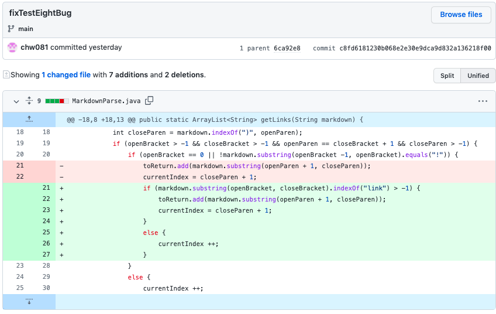
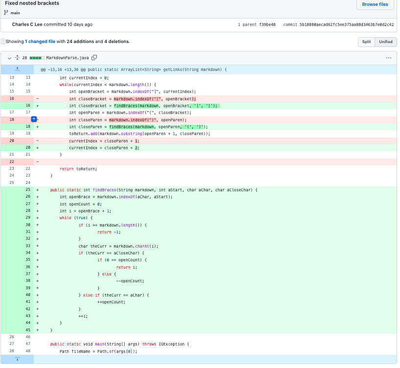
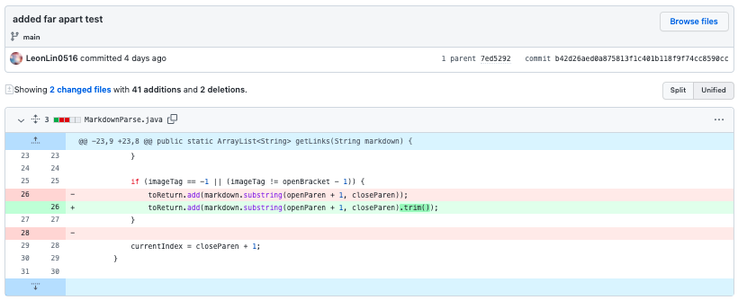

## Lab Report 2

# Code Change Example 1
Screenshot of code change from Ghithub:

Test File for failure-inducing input:
[Link](https://github.com/chw081/cse15l-Week4Report2/blob/main/test-file8.md)

Symptom of failure-inducing input:
fasdfaasasdadasffasasfKJFHKJAHFJKHLSHBLJFHJ

* The relationship between the bug, the symptom, and the failure-inducing input is that because there is nothing in the brackets of the input, the example in the file should not be considered a correct link. It does not have image coding, which is how it would be a link available to the user, because it uses aired brackets first and paired parentheses that are right next to each other.

# Code Change Example 2
Screenshot of code change from Ghithub:

Test File for failure-inducing input:
[Link](https://github.com/Charlychee/markdown-parser/blob/main/test-file2.md)

Symptom of failure-inducing input:
fasdfaasasdadasffasasfKJFHKJAHFJKHLSHBLJFHJ

* The relationship between the bug, the symptom, and the failure-inducing input is that because of the way input is formatted, there is no output and no end to the program. The bug is because of a while loop: there is no while loop exit condition that is ever reached because it never find a second to last parentheses as a last character. So it fails the failure-inducing input uses two quotations and doesn't use parentheses

# Code Change Example 3
Screenshot of code change from Ghithub:

Test File for failure-inducing input:
[Link](https://github.com/LeonLin0516/markdown-parser/blob/main/far-apart.md)

Symptom of failure-inducing input:
fasdfaasasdadasffasasfKJFHKJAHFJKHLSHBLJFHJ

* The relationship between the bug, the symptom, and the failure-inducing input is one where the brackets are far from each other and the url is in the middle sandwhich in between them. The symptom is that when the output includes the white space around the url and therefore we need to go back and fix the code so that we don't include the white space in between.

