# Lab Report 3
## Streamlining ssh Configuration 
The screenshots of my .ssh/config file, 
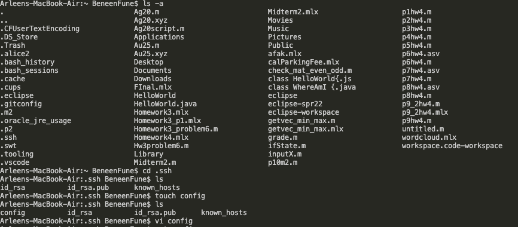
and how you edited it 
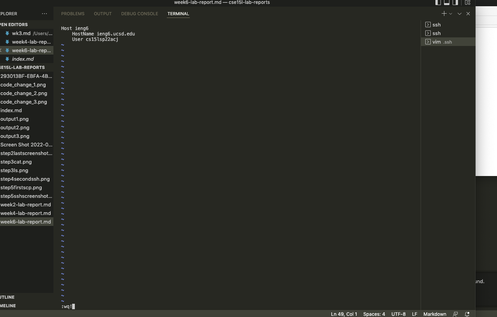

This is the contents the config file
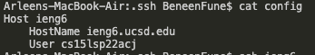

The screenshot of ssh command logging me into my account using just
the alias I choose
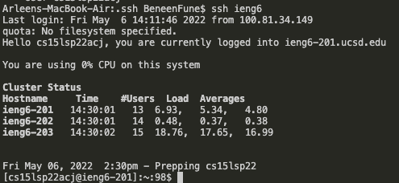

The screenshot of scp command copying a file to your account using just the
alias I choose
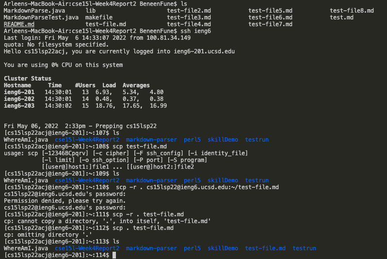

## Setup Github Access from ieng6
The screenshot of the public key I made that is stored on Github and in
your user account
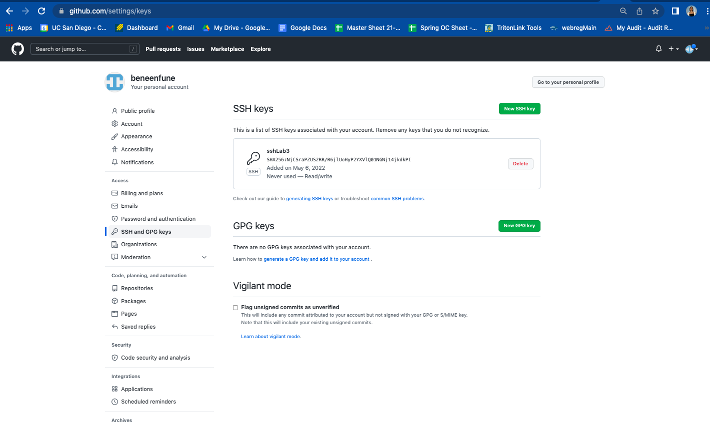

The screenshot of the private key I made that is stored on your user
account (but not its contents)
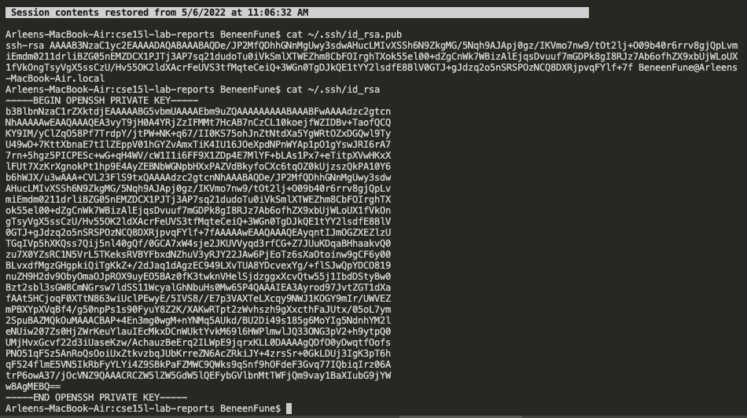

The screenshots of running git commands to commit and push a change to
Github while logged into your ieng6 account
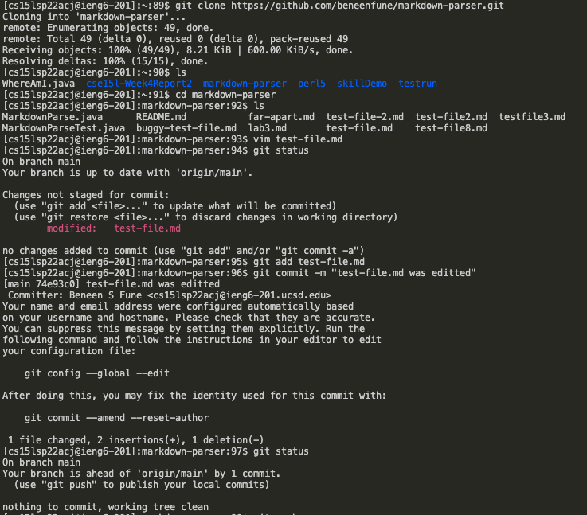
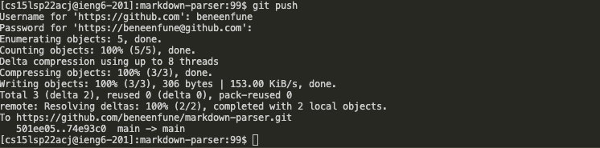

The screenshot of 
[Link for resulting commit is here](https://github.com/beneenfune/markdown-parser/commit/74e93c01b62da7ce4b6d62bfce5ff2598614faa4)

## Copy whole directories with *scp - r*
The screenshot of copying the whole markdown-parse directory to your ieng6
account
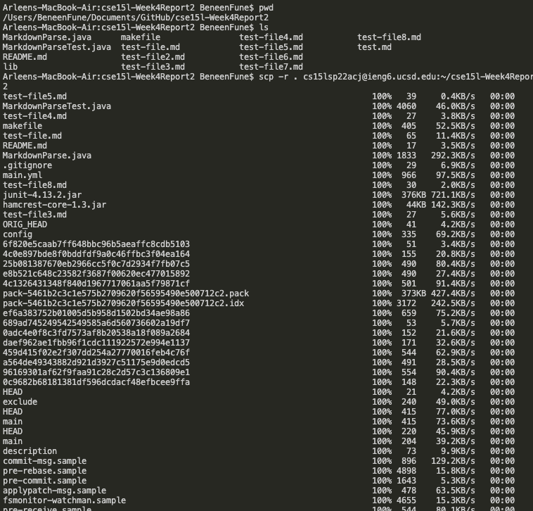
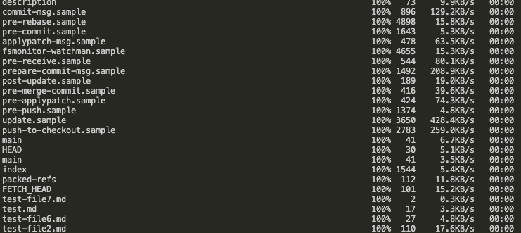

The screenshot of logging into my ieng6 account
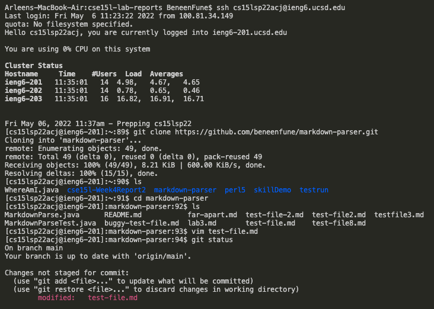

The screenshot of compiling and running the tests for your repository
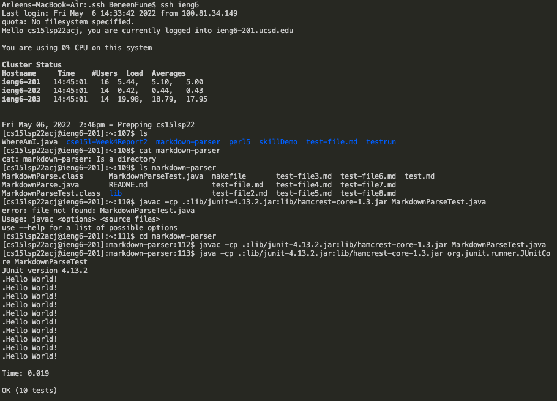

The screenshot of combining scp, ;, and ssh to copy the whole directory and run the tests in one line
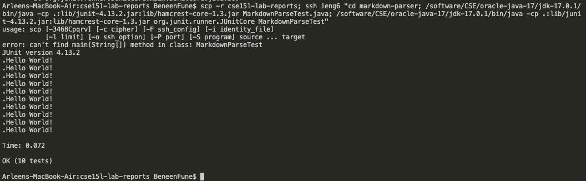

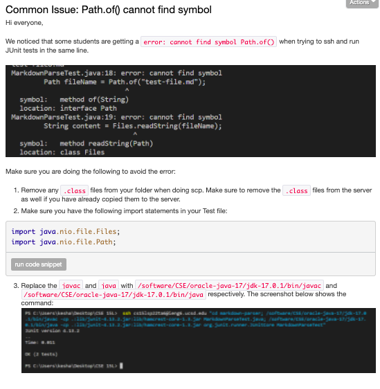