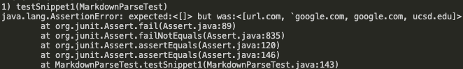
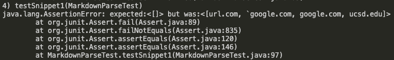
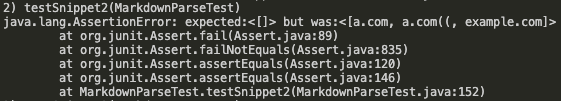
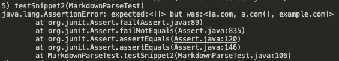
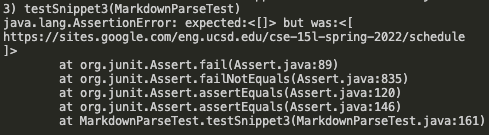
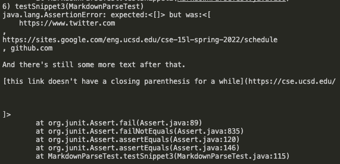

# Lab Report 4 

The link to [my markdown repository](https://github.com/beneenfune/markdown-parser.git).
The link to [the reviewed repository](https://github.com/charvishukla/markdown_parser_2.git).


## Snippet 1
```
`[a link`](url.com)

[another link](`google.com)`

[`cod[e`](google.com)

[`code]`](ucsd.edu)
```
* The test

* My implementation's corresponding output

it did not pass
* The other implementation's corresponding output

it did not pass

* *Do you think there is a small (<10 lines) code change that will make your program work for snippet 1 and all related cases that use inline code with backticks? If yes, describe the code change. If not, describe why it would be a more involved change.* 
A small change I could do  would be to make it so that the getLink() method would ignore the brackets that are found in side of a pair of backticks. This would make it sould that it doesn count the [a link....com) (from inside the snippet) as a link as it is would therefore miss the first bracket as it is between the two backticks.

## Snippet 2
```
[a [nested link](a.com)](b.com)

[a nested parenthesized url](a.com(()))

[some escaped \[ brackets \]](example.com)
```

* The test

* My implementation's corresponding output

it did not pass
* Week 7 implementation's corresponding output

it did not pass

* *Do you think there is a small (<10 lines) code change that will make your program work for snippet 2 and all related cases that nest parentheses, brackets, and escaped brackets? If yes, describe the code change. If not, describe why it would be a more involved change.* 
This code change would require a more involved change because it requires a through search of nested parentheses. We would have to use a loop to check for open brackets, open parentheses, closed brackets, and closed parentheses and in the correct manner of one open being in order of one closed being, whatever that may be. For example, we would have to distingiush between which closing parentheses is the true closing parentheses as there could be one, but not th true one, inside of the actual link.

## Snippet 3
```
[this title text is really long and takes up more than 
one line

and has some line breaks](
    https://www.twitter.com
)

[this title text is really long and takes up more than 
one line](
https://sites.google.com/eng.ucsd.edu/cse-15l-spring-2022/schedule
)


[this link doesn't have a closing parenthesis](github.com

And there's still some more text after that.

[this link doesn't have a closing parenthesis for a while](https://cse.ucsd.edu/


)

And then there's more text
```

* The test

* My implementation's corresponding output

it did not pass
* Week 7 implementation's corresponding output

it did not pass

* *Do you think there is a small (<10 lines) code change that will make your program work for snippet 3 and all related cases that have newlines in brackets and parentheses? If yes, describe the code change. If not, describe why it would be a more involved change.* 
This code change would also need a more involved change because it would need to adjust to the issue of nested parentheses. The program, like for the code change in for snippet 2, would need to be able to distingiush between nested parentheses and the true parentheses and would therefore need a through algorithm to do so.