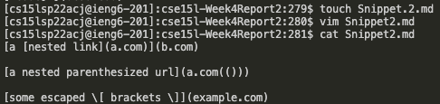

# Lab Report 4 

[The link to my markdown repository.](https://github.com/beneenfune/markdown-parser-my.git)
[The link to the reviewed markdown repository from week 7.](https://github.com/beneenfune/markdown-parser.git)


## Snippet 1
```
`[a link`](url.com)

[another link](`google.com)`

[`cod[e`](google.com)

[`code]`](ucsd.edu)
```
* The test

* What it should produce

* How I turned it into a test in **MarkdownParseTest.java** in both my and week 7's implementation
I made the snippet in the remote ssh ieng6 server using *touch* and *vim*. 

After, I put the actual test into **MarkdownParseTest.java** using *vim*.


* My implementation's corresponding output

it did not pass
* Week 7 implementation's corresponding output

it did not pass

* *Do you think there is a small (<10 lines) code change that will make your program work for snippet 1 and all related cases that use inline code with backticks? If yes, describe the code change. If not, describe why it would be a more involved change.* 
There is not a small change possible because locating all of the backticks will take more than 10 lines of code to do. It might even require a new function to do so in MarkdownParse.java. In addition to checking for the bacticks, we will have to chechk if there is an odd number of them or an even number of them. Also, we would have check if the back ticks are inside brackets or parentheses.

## Snippet 2
```
[a [nested link](a.com)](b.com)

[a nested parenthesized url](a.com(()))

[some escaped \[ brackets \]](example.com)
```

* The test

* What it should produce

* How I turned it into a test in **MarkdownParseTest.java** in both my and week 7's implementation
I made the snippet in the remote ssh ieng6 server using *touch* and *vim*. 

After, I put the actual test into **MarkdownParseTest.java** using *vim*.


* My implementation's corresponding output

it did not pass
* Week 7 implementation's corresponding output

it did not pass

* *Do you think there is a small (<10 lines) code change that will make your program work for snippet 2 and all related cases that nest parentheses, brackets, and escaped brackets? If yes, describe the code change. If not, describe why it would be a more involved change.* 
This code change would require a more involved change because it requires a through search of nested [] and (). We would have to use a loop to check for open brackets, open parentheses, closed brackets, and closed parentheses and in the correct manner of one open being in order of one closed being, whatever that may be.

## Snippet 3
```
[this title text is really long and takes up more than 
one line

and has some line breaks](
    https://www.twitter.com
)

[this title text is really long and takes up more than 
one line](
https://sites.google.com/eng.ucsd.edu/cse-15l-spring-2022/schedule
)


[this link doesn't have a closing parenthesis](github.com

And there's still some more text after that.

[this link doesn't have a closing parenthesis for a while](https://cse.ucsd.edu/


)

And then there's more text
```

* The test

* What it should produce

* How I turned it into a test in **MarkdownParseTest.java** in both my and week 7's implementation
I made the snippet in the remote ssh ieng6 server using *touch* and *vim*. 

After, I put the actual test into **MarkdownParseTest.java** using *vim*.


* My implementation's corresponding output

it did not pass
* Week 7 implementation's corresponding output

it did not pass

* *Do you think there is a small (<10 lines) code change that will make your program work for snippet 3 and all related cases that have newlines in brackets and parentheses? If yes, describe the code change. If not, describe why it would be a more involved change.* 
This code change would also need a more involved change because it would need to check for multiple new lines at a time and need a way to bypass that in order to not include it in the bracket or parentheses consideration. If new lines weren't there the new line would have to be eliminated from the count.
